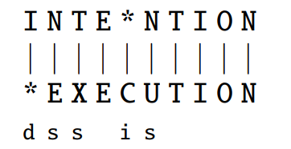

# Week 01: Byte Pair Encoding (BPE) and Edit Distance

## Tokenizers

- Modern tokenizers often use data to automatically tell what tokens should be.
- They automatically induce sets of tokens that include tokens smaller than words, called subwords. The use of subwords helps us to deal with unknown words.
- Most tokenization schemes have two parts: a token learner, and a token segmenter.
- Most of the NLP tasks will have included a given tokenizer.
- Three algorithms are widely used:
    - byte-pai encoding
    - unigram language modeling
    - WordPiece

## Byte Pair Encoding (BPE)
BPE is a method for automatic word tokenization. The process involves merging the most frequent adjacent symbols in the text, and continues until reaching a desired vocabulary size.

### Algorithm Explanation 

**Preprocessing Step**: 
- Segment the words in different chars and add the additional underscore char.
- Count the words frequencies 
- Add the unique chars to a vocabulary.

You will start with something like this after the preprocessing

```
Vocabulary: _, d, e, i, l, n, o, r, s, t, w


Words
5 l o w _
2 l o w e s t _
6 n e w e r _
3 w i d e r _
2 n e w _
```

**Main Loop until k merges**
1. Look for every pair of characters in each word, count, and get the total frequency (consider the word frequency).
2. Get the pair with the highest frequency (charL, charR)
3. The pair with the highest frequency is added to the vocabulary as a single char (NOTE: there can be some ties)
4. Replace each occurrence of (charL, charR) in other words by grouping together as a single char.

**NOTE**: The previous part corresponds to the token learner. The token segmenter will take similar steps to the learner. It will loop by merging pairs of chars, but instead of changing the vocabulary it will find matches with the vocabulary (in the order that we learned during training).

# Minimum Edit Distance

The minimum edit distance corresponds to the minimum number of operations (deletion, insertion and substitution) required to change one word into another.

- It is used in NLP for tasks like spell checking, speech recognition, and machine translation to find the closest words(s) to a given input.

- The minimum edit distance helps us to understand how similar two strings are.

**Alignment**
- An alignment is the correspondence between the substrings of the two sequences.
- An alignment is a way to visualize the edit distance between two strings.
- We don't need to align a string to find the minimum distance. Conversely, the alignment is a result of the edit distance. The following example has an edit minimum distance of 5 if every operation is considered to have a cost of 1.




- Getting the minimum edit distance can be considered as a search task, in which we are searching for the shortest path (a sequence of edits) from one string to another.

- Then, using dynamic programming we can use the solution of small sub-problems to build the solution of the complete problem.

The algorithm follows a dynamic programming approach, following the next update rule


**Not too relevant**

- We can employ a dynamic programming approach because the journey towards the optimal solution is constructed using subpaths that remain optimal up to their respective points in the sequence of edits. 
    - For instance, when transitioning from "intention" to "execution," we must navigate through an edit that transforms it into "exention." The path from "intention" to "exention" represents the optimal route for that specific subpath.