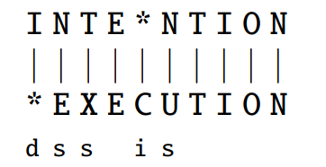

# Week 01: Byte Pair Encoding (BPE) and Edit Distance

BPE is a method for automatic word tokenization.
- The process involves merging the most frequent adjacent symbols in the text.
- Continues until reaching a desired vocabulary size.
- **Example**: For "low" and "lower", initial tokens are ["l", "o", "w", "e", "r"]. BPE might merge "e" and "r" to form "er".

## Algorithm Explanation 

**Preprocessing Step**: 
- Segment the words in different chars and add the additional underscore char.
- Count the words frequencies 
- Add the unique chars to a vocabulary.

You will start with something like this after the preprocessing

```
Vocabulary: _, d, e, i, l, n, o, r, s, t, w


Words
5 l o w _
2 l o w e s t _
6 n e w e r _
3 w i d e r _
2 n e w _
```

**Main Loop**
1. Look for every pair of characters in each word, count, and get the total frequency (consider the word frequency).
2. Get the pair with the highest frequency (charL, charR)
3. The pair with the highest frequency is added to the vocabulary as a single char (NOTE: there can be some ties)
4. Replace each occurrence of (charL, charR) in the words, in other words, grouped together as a single char.

# Minimum Edit Distance

The minimum edit distance corresponds to the minimum number of operations (deletion, insertion and substitution) that must done in order to transform one word into another.



The algorithm follows a dynamic programming approach, following the next update rule

TODO: Put the image